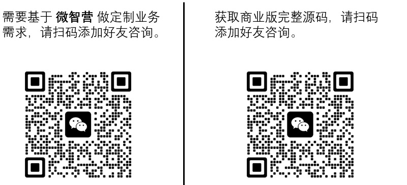

  <a href="./README.md">简体中文</a> |
  <a href="./README.en.md">English</a> 

# MicroIntelligence Camp Frontend

### Introduction
Marketing channels abroad are relatively singular, primarily relying on EDM. In China, due to the diversity of channels, marketing scenarios are much more complex. Currently, the main channels for user marketing outreach in China include:

- Enterprise WeChat private chats, communities, and朋友圈
- WeChat official accounts, mini-programs, and video channels
- E-commerce platforms like Douyin, Kuaishou, Taobao, JD.com, and Pinduoduo
- Public domain operations such as SMS, email, app pop-ups, PUSH notifications, and banner ads
- Other channels

Although many MarTech companies in China have developed excellent SaaS products, the market demand is still not fully met. The main issues are:

- **Pain Point** — Enterprises are more concerned about data security, privacy protection, and compliance issues, leading to a strong preference for private deployment.
- **Pain Point** — The complexity of business scenarios requires integration with full-domain business environments for unified marketing, rather than simply purchasing a set of system tools.
- **Pain Point** — The need for source code. More and more enterprises are choosing to build their own systems to create marketing systems that better fit their business needs. The main reason behind this is that the standard tools available on the market are disconnected from business needs and lack flexibility for customization.

Given these pain points, enterprises with some scale have only one path to solve these issues: building their own systems. However, the biggest problem they face when choosing to build their own is:

**High Cost and Long Cycle for Building from 0 to 1**

Developing a complex marketing automation system from scratch is not as simple as it seems. It requires a lot of manpower and resources, and often, results are not visible in the short term, which can easily lead to the project being abandoned. So, what are some good solutions to this problem?

### Application Areas of AI Marketing Systems

Suitable for enterprise clients in various industries such as manufacturing, retail, tourism, education, FMCG, and technology.

### Product Introduction
There are very few open-source large model AI marketing automation projects. **MicroIntelligence Camp** is specifically open-sourced in this context to contribute to the digital marketing efforts in China.

**MicroIntelligence Camp** is based on a **"Prospecting -> Management -> Operation -> Marketing -> Service -> Analysis"** one-stop AI digital marketing engine. It provides standardized functions and basic capabilities, allowing enterprises to quickly build a marketing automation system suitable for their own business, rapidly completing the process from 0 to 1. Moreover, based on open capabilities and source code, enterprises can develop AI marketing systems deeply integrated with their own business.

As a new product in the field, **MicroIntelligence Camp** also needs to move forward step by step. The future development is mainly divided into the following stages:

**Building a Basic Marketing Platform**

At this stage, we have combined current marketing trends and chosen to start with the enterprise WeChat scenario. In this phase, we will provide basic enterprise WeChat marketing functions, retaining flexibility for expansion, allowing developers to quickly develop desired functions based on **MicroIntelligence Camp**.

**Building Full-Domain Marketing Capabilities**

At this stage, we will focus on improving the platform's full-domain marketing capabilities, integrating more marketing scenarios, automation capabilities, etc.

**Rapid Iteration of Automation Scenarios**

At this stage, we will quickly build full-domain marketing automation solutions based on scenarios.

### Product Advantages

1. Large model assistance to enhance competitiveness
2. Highly available system, flexible and efficient deployment
3. Cost-effective R&D, meeting customization needs
4. Data security and control
5. Reduced reliance on cloud services and vendor lock-in

### AI Capabilities

Currently, the open-source version of **MicroIntelligence Camp** is built based on excellent open-source products like Yudao, supporting large model knowledge bases and AI Agent orchestration for advanced assistants. It supports over 30 AI large models such as DeepSeek, Tongyi Qianwen, and Tencent Hunyuan, enabling intelligent marketing-related capabilities.

### 12 Major Product Functions — Meeting the Complete Lifecycle of Enterprise AI Marketing

**1. Large Model Knowledge Base:** A large model-driven information processing system, widely meeting needs in Q&A, translation, creation, and other fields.

**2. Large Model Intelligent Assistant:** Provides precise information retrieval and task execution services.

**3. Large Model Advanced Assistant:** An RPA assistant orchestrated by large model Agents, combining AI and automation technologies to achieve complex business processes.

**4. Channel Management:** Multi-channel support.

**5. Customer Service:** Omni-channel intelligent customer service, flexible allocation, and efficient service.

**6. Customer Management:** Helps enterprises build an efficient customer operation system.

**7. Marketing Center:** Builds strategic customer groups for automated and precise marketing.

**8. Lead Generation:** Multi-channel lead generation through live codes, group live codes, public pools, and customer service for precise customer acquisition.

**9. Content Center:** Builds an enterprise's own content library with multi-type materials for one-click use.

**10. Enterprise Risk Control:** Conversation compliance archiving, global risk control for sensitive content.

**11. Product Management:** Maintains and updates the list of products available for sale, ensuring information accuracy and real-time updates.

**12. Order Management:** Records product orders for tracking and recording completed order information.

### Custom Development/Technical Support

