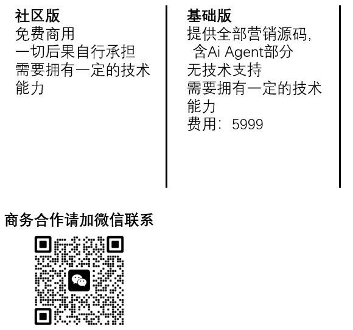

  <a href="./README.md">简体中文</a> |
  <a href="./README.en.md">English</a> 

# 微智营

基于 **企业微信** 实现业务 + AI闭环

目前  **微智营**  是基于一众优秀开源产品进行二次开发构建，支持大模型知识库、人工智能Agent编排高级助手；大模型方面支持DeepSeek、通义千问、腾讯混元等 30+ AI大模型，实现营销相关能力智能化。

### 在线演示
在线演示地址请添加下方微信

### AI营销系统的应用领域

适用于制造业、零售、旅游、教育、快消品、科技等多个行业的企业客户。

### 产品介绍
开源的大模型人工智能营销自动化项目寥寥无几， **微智营**  在此背景下特意开源出来，以为国内数字化营销贡献绵薄之力。

**微智营**  基于  **“拓客->管理->运营->营销->服务->分析”**  一站式人工智能数智化营销引擎，通过提供的标准化功能和基础能力，让企业快速搭建适合自己企业的自动化营销系统，快速完成从 0-1 的过程，并且能基于开放的能力和源码，开发深度融合自身业务的AI营销系统。

**微智营**  作为领域的产品新秀，也需要一步一个脚印逐步向前迈进。对未来的发展主要分以下几个阶段：

**构建基础营销平台**

       此阶段我们结合了当下营销的趋势，选择了优先从企业微信场景切入。 在这个阶段我们会提供个比较基础的企业微信营销功能，保留了其灵活的扩展性，便于开发者能够快速基于  **微智营**  开发自己想要的功能。

**全域营销能力搭建**

       此阶段我们会重点完善平台的全域营销能力，我们会接入更多的营销场景通道、自动化能力等。

**自动化场景快速迭代**

       此阶段我们会快速基于场景构建全域营销自动化方案。

### 产品优势

1.  大模型助力，提高竞争力
2.  系统高度可用，部署灵活高效
3.  研发降本增效，满足定制需求
4.  数据安全可控
5.  降低云服务依赖与供应商绑定

### 12大产品功能 — 满足企业AI营销完整生命周期

**1.  大模型知识库：** 大模型驱动的信息处理系统，广泛满足问答、翻译、创作等领域；

**2.  大模型智能助手：** 提供精准的信息检索和任务执行服务；

**3.  大模型高级助手：** 大模型Agent编排的RPA助手，结合人工智能与自动化技术，实现复杂业务流程；

**4.  渠道管理：** 多渠道支持；

**5.  客服：** 全渠道智能客服，灵活分配，高效服务；

**6.  客户管理：** 助力企业搭建高效运营客户体系；

**7.  营销中心：** 构建策略人群，全程自动精准营销；

**8.  引流获客：** 活码、群活码、公海、客服等多渠道引流，实现精准获客；

**9.  内容中心：** 搭建企业自有内容库，多类型素材一键调用；

**10.  企业风控：** 会话合规存档，敏感内容全局风控；

**11.  产品管理：** 维护和更新可供销售的产品清单，确保信息的准确性和实时性；

**12.  订单管理：** 产品订单记录，用于追踪和记录已完成订单的产品信息；

### 服务说明

