

  <a href="./README.md">简体中文</a> |
  <a href="./README.en.md">English</a> 

# 数智营

## 数智营：一站式AI全域经营，中小企业的智能运营中枢

专注于为中小微企业打造由AI驱动的智能运营中枢，致力于成为企业增长的强劲引擎，通过先进的AI解决方案，助力客户在日新月异的商业环境中，实现运营效能的飞跃与商业价值的持续增长。

## 核心价值：AI驱动全链路，打造营销经营新范式

**数智营** 以AI驱动社交客户关系管理，打通从获客到资产沉淀的全链路自动化运营，让中小企业拥有智能增长中枢，实现客户价值的持续进化。

- **AI智能策划，高效产出优质内容**  — 基于行业趋势与用户洞察，AI自动生成营销方案与创意内容，解决人才稀缺、内容质量低的痛点，降低人力成本，提升营销效益。
- **深耕行业，构筑专业壁垒**  — 深度聚焦科技与新消费等高增长潜力领域，持续深耕，积累丰富的行业经验与专业资源，形成难以复制的行业洞察力，构筑坚实的专业壁垒。
- **AI驱动，强化智能内核**  — 构建以自然语言交互为核心的AI智能运营中枢。用户通过语音或文字下达指令，系统即可自动完成营销素材（文档、图片、视频）生成、SOP流程构建、智能客服接待、内容自动发布与互动策略执行等一系列复杂的运营动作，实现从‘人操作’到‘人机协同’的效率革命。
- **生态协同，实现价值共赢**  — 积极与各领域优秀伙伴建立战略合作，构建开放共赢的合作网络。通过资源共享与优势互补，为客户提供更全面的服务，实现生态各方的价值最大化。

## 产品建设路径：从基础到全域，稳步构建AI营销能力
 **1.基础营销平台构建** 
以企业微信为核心切入点，提供灵活、可扩展的营销功能，帮助企业快速搭建适配自身业务的营销体系，完成从0到1的高效启动。

 **2.AI经营与自动化升级** 
通过AI重塑客户关系与营销流程，构建自动化场景与智能运营体系，实现营销动作的自动触发与持续优化，提升人效与转化率。

 **3.全域营销能力拓展** 
持续接入国内外多通道营销场景，完善公私域联动能力，支持企业在复杂环境中实现一体化、全渠道的智能经营。

### 适用场景

用于 **服装制造、零售、电商、法律、金融、餐饮、旅游、教育** 等多个行业，致力于帮助企业高效引流客户、实现精准转化与深度运营。系统提供强大的后台支持与高度灵活的运营模式，助力企业构建稳定、高效的客户关系体系，拓展多元盈利路径，推动业务持续增长。

### 产品架构

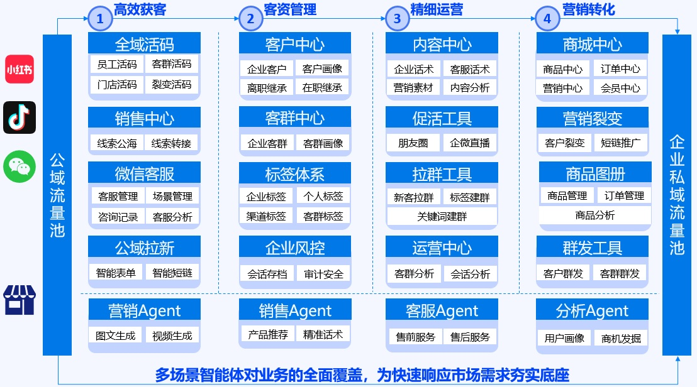

###  商务合作、定制开发请加企微

###  仓库地址

github: https://github.com/wangmingf83/WeSmart

gitee:  https://gitee.com/wangmingf83/WeSmart

### 系统截图

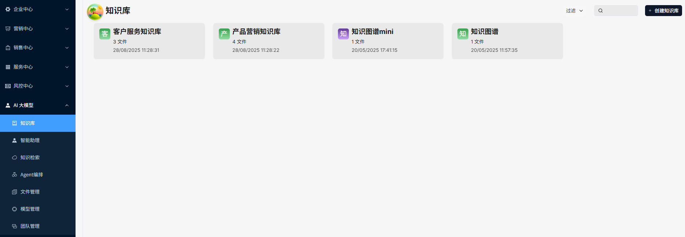

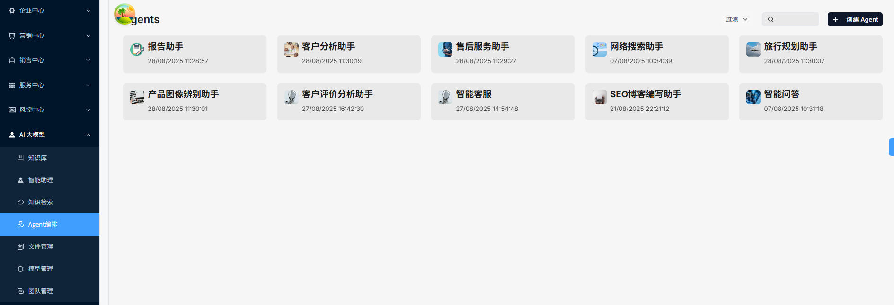

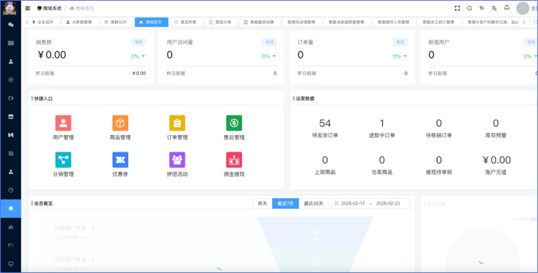

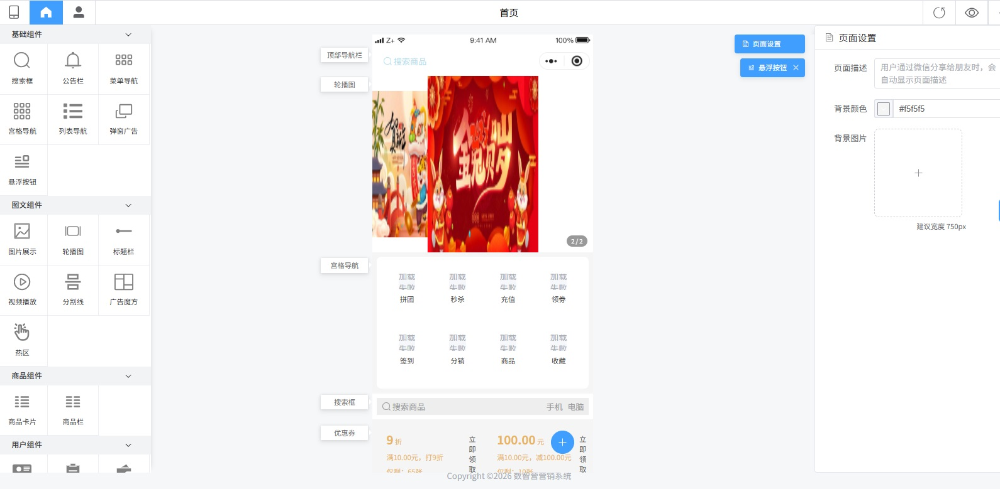

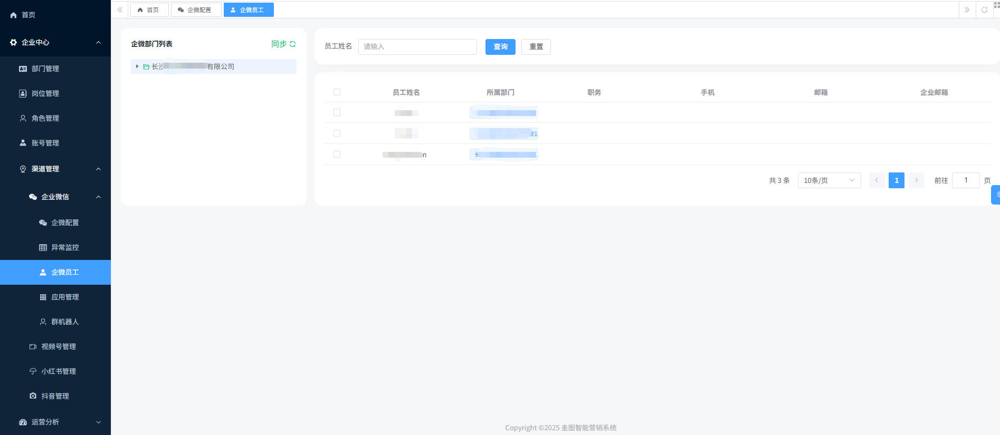

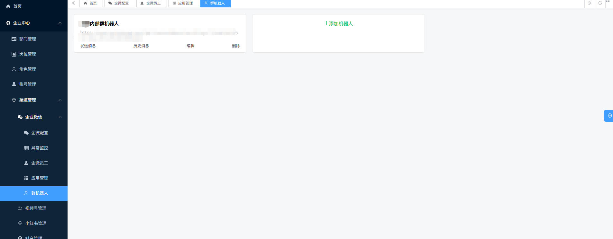

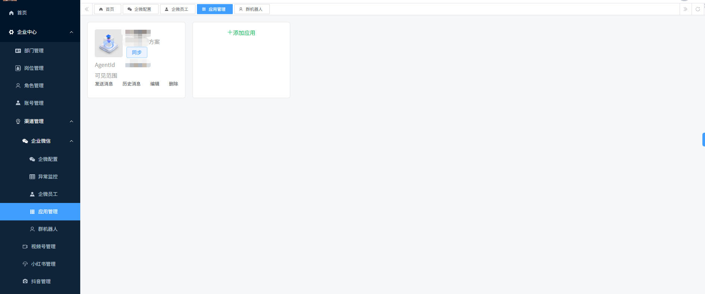

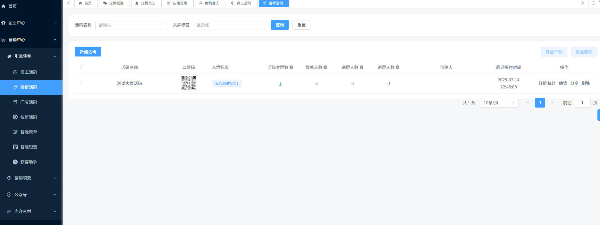

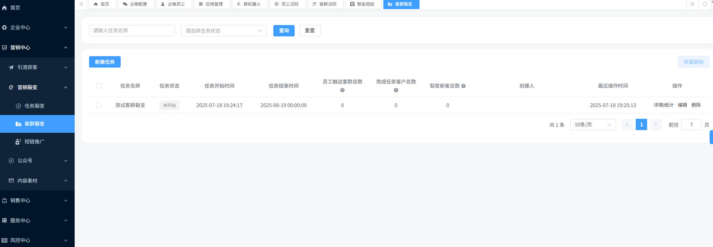

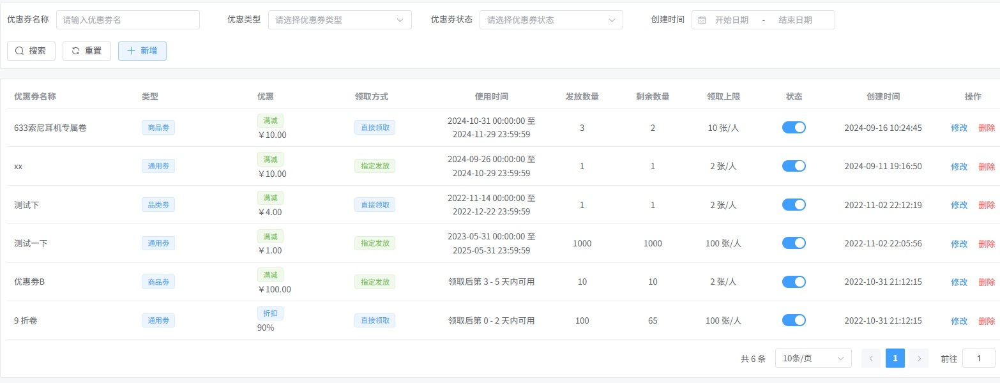

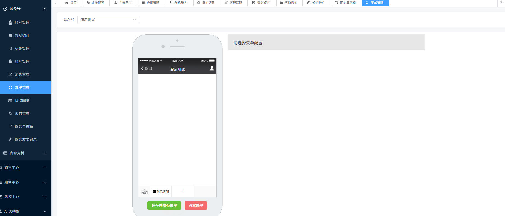

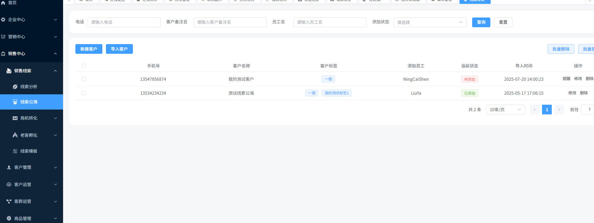

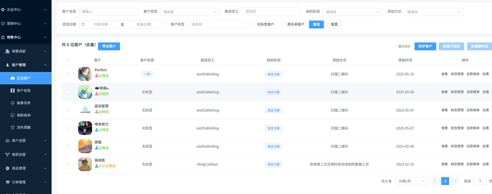

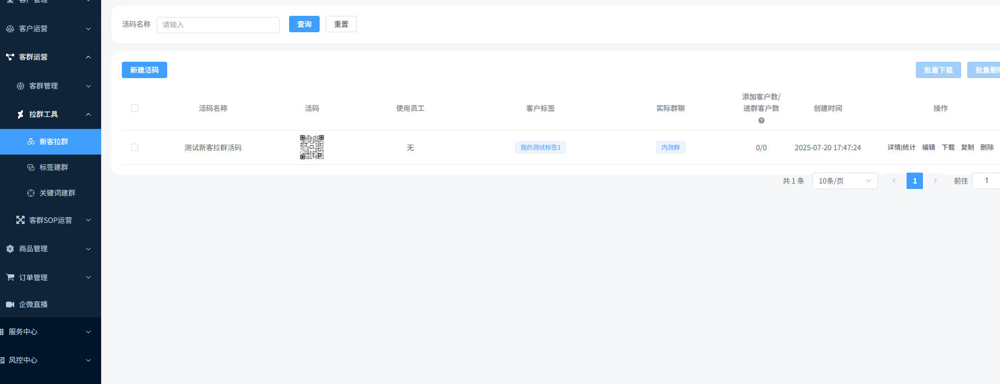

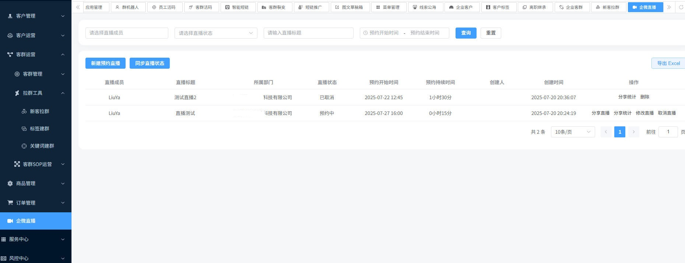

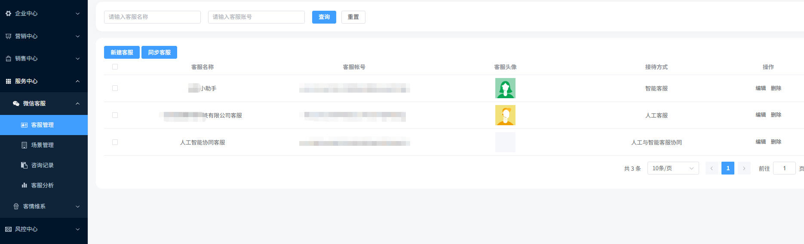

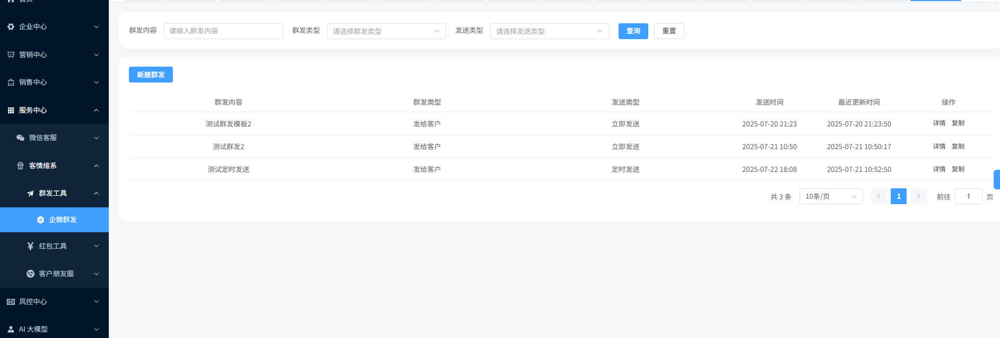

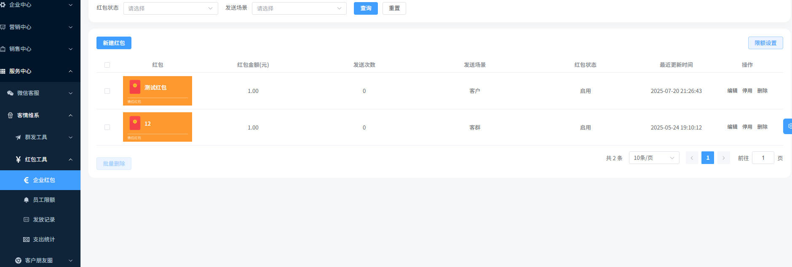

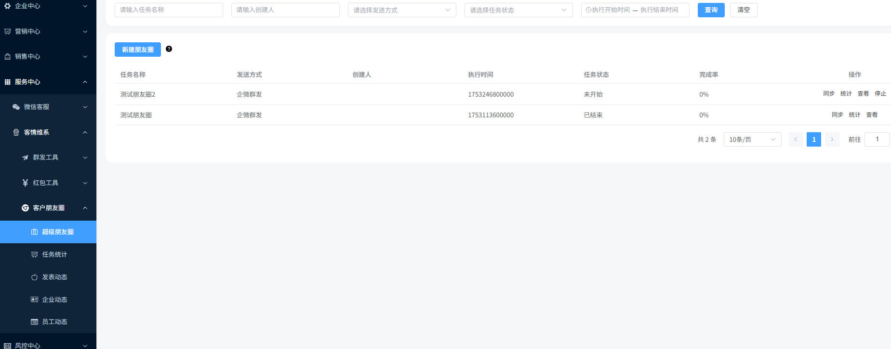

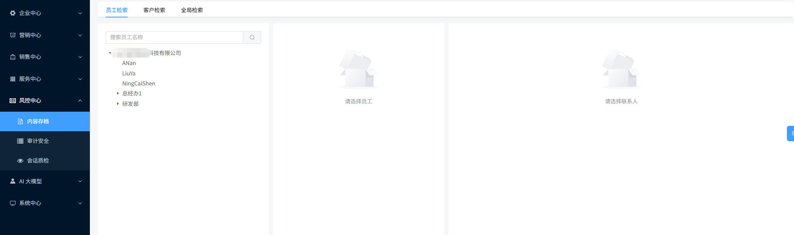

