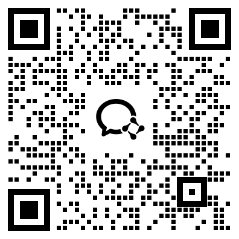

  <a href="./README.md">简体中文</a> |
  <a href="./README.en.md">English</a> 

[]
[]
[]

<h1 align="center">WeSmart (微智营)</h1>

  <strong>一站式 AI 全域经营，中小企业的智能运营中枢</strong>

  专为中小微企业打造的 <strong>AI+SCRM（社交客户关系管理）</strong> 开源系统。我们致力于解决企业在数字化转型中面临的<strong>“缺人才、创作难、成本高、挖掘难”</strong>四大核心痛点。

  我们打通了 <strong>“企业微信、个人微信、公众号、视频号、抖音”</strong>等生态。

---

### 🚀 核心价值：构建“生成式 AI”驱动的私域自动化闭环

WeSmart 引入了深度 AI 能力，打通了从**“内容生产”**到**“客户成交”**的完整链路。我们实现了真正的 **AI + 私域自动化闭环**，让企业运营从“人找事”升级为“事找人”。

**我们的核心逻辑：**
`AI 指令` ➡️ `生成内容` ➡️ `生成视频` ➡️ `私域 SOP` ➡️ `触达客户` ➡️ `智能客服` ➡️ `转化跟进`

1.  **🧠 智能指令驱动 (Intelligent Command)**
    *   **你开口，它动手**：基于自然语言交互，用户只需下达简单的文字或语音指令（如“下周做一场促销”），系统即可自动编排任务。
    *   **智能决策**：AI 自动分析市场与客户画像，生成最优营销策略组合。

2.  **✍️ 内容与视频全自动生成 (Content & Video Generation)**
    *   **文案秒出**：AI 自动生成朋友圈文案、公众号推文、私聊话术，解决 80% 的内容创作瓶颈。
    *   **视频智造**：输入关键词，AI 自动完成脚本生成、素材匹配、剪辑合成，批量产出高质量营销短视频，让企业轻松玩转视频号与抖音。

3.  **🤖 私域 SOP 自动化触达 (SOP & Automation)**
    *   **全流程执行**：系统自动将策略转化为标准化 SOP，执行“加好友、打标签、拉群、发朋友圈”等动作。
    *   **精准分发**：根据客户画像，自动将生成的内容与视频分发给目标人群，实现千人千面的精准触达。

4.  **💬 智能客服与转化 (Intelligent Conversion)**
    *   **7x24h 专家级客服**：基于企业专属知识库，AI 客服能精准回答产品咨询、处理常见问题，甚至主动发起营销。
    *   **人机协同跟进**：AI 筛选出高意向线索，自动流转给人工销售进行深度转化，大幅提升人效。

---

### 产品架构

---

### 🌟 为什么选择 WeSmart？

*   **🚀 降本增效，全员“AI 助手”**
    *   **AI 写作与设计**：集成智能写作与绘图能力，无需专业设计师或文案，普通员工也能产出专业级营销素材。
    *   **自动化引擎**：将重复性工作（如群发、打标、回复）交由机器处理，释放人力，让团队专注于策略思考。

*   **🔗 全域流量，统一管理 (Omni-Channel)**
    *   **打破孤岛**：深度集成企业微信，打通微信公众号、视频号、抖音、小红书等多渠道数据。
    *   **客户资产留存**：客户资源归属企业而非员工，支持离职继承与流失预警，确保企业资产零流失。

*   **🎯 精细化运营，千人千面**
    *   **360° 客户画像**：基于 RAG（检索增强生成）技术构建精准用户标签体系。
    *   **自动化裂变**：通过裂变海报、拼团、秒杀等工具，自动触发促活与转化动作，提升复购率。

---

### 📦 系统功能全景图

| 核心模块 | 关键能力 | 业务价值 |
| :--- | :--- | :--- |
| **AI 智能中心** | AI 写作、AI 视频生成、智能客服、知识库 | 解决内容生产难、客服人力成本高的问题 |
| **引流获客** | 渠道活码、LBS 门店导购、智能表单、裂变工具 | 解决流量贵、线索无法追踪、无法沉淀的问题 |
| **客户运营** | 客户画像、标签建群、超级朋友圈、群 SOP | 解决客户管理混乱、群活跃度低、转化难的问题 |
| **销售转化** | 线索公海、商机管理、订单同步、分销返利 | 解决线索跟进不及时、业绩统计繁琐的问题 |

---

### 💼 适用场景

**WeSmart 适用于所有需要通过私域进行客户经营和变现的行业，包括但不限于：**

*   **零售/连锁**：门店导购数字化、会员复购管理。
*   **电商/本地生活**：订单售后跟进、用户复购促活。
*   **知识付费/教育**：课程分销、学员社群运营。
*   **B2B/服务业**：销售线索管理、客户生命周期维护。

---

###  交流群

###  商务合作、定制开发请加微

###  仓库地址

github: https://github.com/wangmingf83/WeSmart

gitee:  https://gitee.com/wangmingf83/WeSmart

### 系统截图

