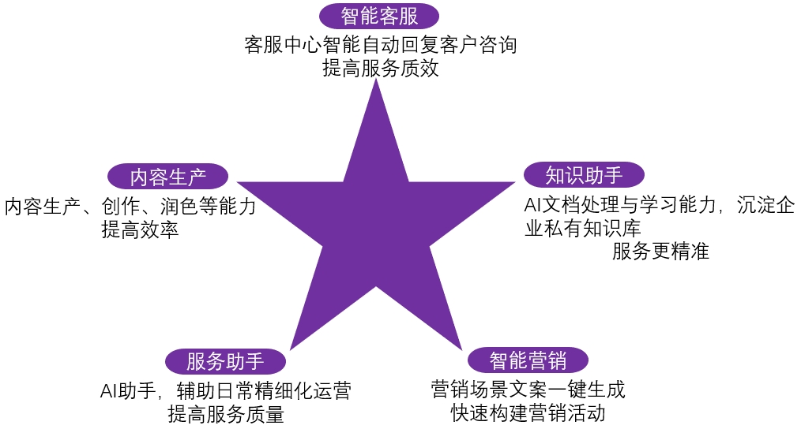
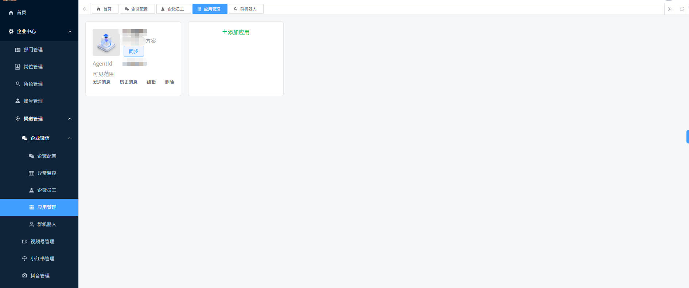
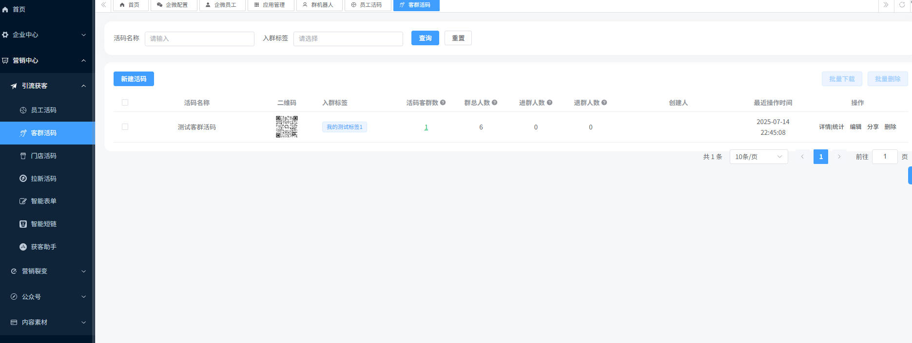
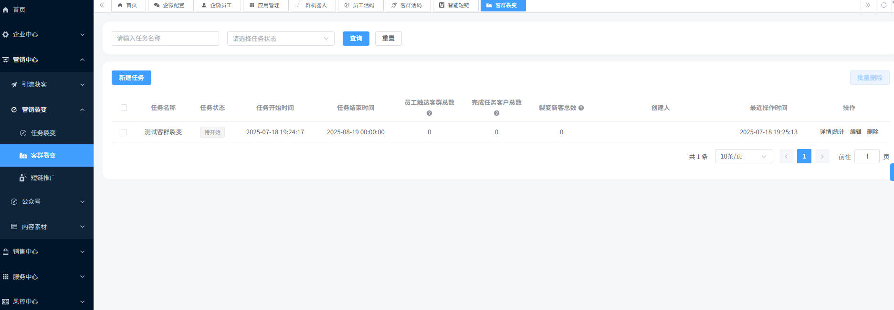
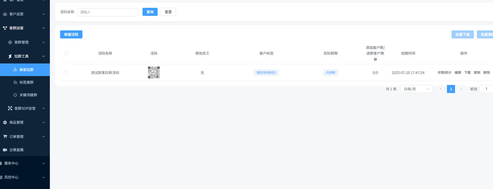
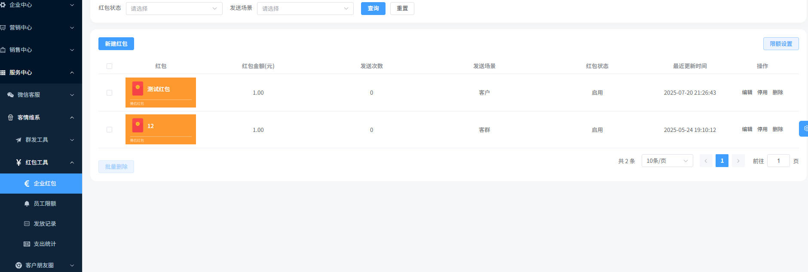

  <a href="./README.md">简体中文</a> |
  <a href="./README.en.md">English</a> 

# 微智营

## 数智营：一站式AI数智化营销引擎，重塑企业全域经营

在营销环境日益复杂的今天，企业面临着渠道多元、内容质量不足、客户跟进滞后、数据安全隐忧等多重挑战。传统的SaaS工具难以满足企业个性化、一体化的营销需求，越来越多的企业选择自建系统，却受困于高昂的周期成本与技术门槛。

## 核心价值：AI驱动全链路，打造营销经营新范式

**数智营** 以“AI经营”为核心理念，深度融合智能策划、全域引流、精准触达与客户服务，构建覆盖“策划-获客-运营-成交-分析”的一站式营销经营体系，实现真正意义上的线上销售全生命周期闭环。

- **AI智能策划，高效产出优质内容**  — 基于行业趋势与用户洞察，AI自动生成营销方案与创意内容，解决人才稀缺、内容质量低的痛点，降低人力成本，提升营销效益。
- **全域引流获客，打通多渠道流量**  — 无缝连接企业微信、抖音、淘宝、公众号、短信等主流渠道，实现公域引流与私域沉淀的一体化运营，帮助企业构建自主流量阵地，降低平台依赖。
- **AI客户服务，实时响应不失商机**  — 通过智能客服与自动化跟进，实时识别客户意向并快速响应，提升转化效率，避免商机流失。
- **智能成交与数据分析，驱动持续优化**  — AI自动生成订单意向，并基于数据反馈不断优化营销策略，形成“执行-分析-迭代”的良性循环，助力企业实现精细化运营与持续增长。

## 产品建设路径：从基础到全域，稳步构建AI营销能力
 **1.基础营销平台构建** 
以企业微信为核心切入点，提供灵活、可扩展的营销功能，帮助企业快速搭建适配自身业务的营销体系，完成从0到1的高效启动。

 **2.AI经营与自动化升级** 
通过AI重塑客户关系与营销流程，构建自动化场景与智能运营体系，实现营销动作的自动触发与持续优化，提升人效与转化率。

 **3.全域营销能力拓展** 
持续接入国内外多通道营销场景，完善公私域联动能力，支持企业在复杂环境中实现一体化、全渠道的智能经营。

### 适用场景

用于 **服装制造、零售、电商、法律、金融、餐饮、旅游、教育** 等多个行业，致力于帮助企业高效引流客户、实现精准转化与深度运营。系统提供强大的后台支持与高度灵活的运营模式，助力企业构建稳定、高效的客户关系体系，拓展多元盈利路径，推动业务持续增长。

### 产品优势

### 加微入微信群交流

###  商务合作、定制开发请联系

**手机：** 13512785017

**微信：** 13512785017

###  仓库地址

github: https://github.com/wangmingf83/WeSmart

gitee:  https://gitee.com/wangmingf83/WeSmart

### 系统截图

